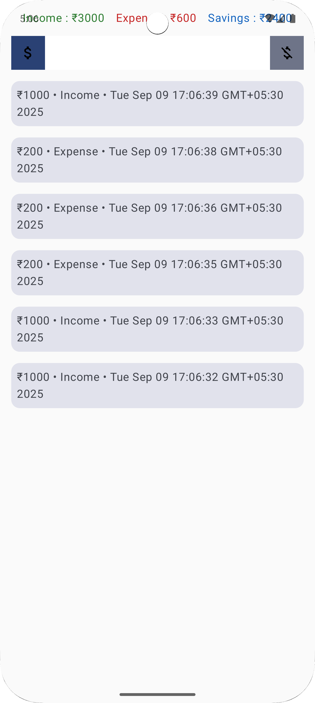

# 💰 Expense Tracker App

A **simple Expense Tracker app** built with **Kotlin**, **Room Database**, **ViewModel**, and **Jetpack Compose**.
This app helps users track daily income & expenses, categorize them, and store everything offline in RoomDB.

---

## 🚀 Features

-✅ Add, update, delete tasks
-📌 Mark tasks as completed
-💾 Persistent storage with Room Database
-🎨 Modern Jetpack Compose UI
-🔄 Live updates using Flow + ViewModel

---

## 📸 Screenshots
| Main Screen |
|  |

---

## 🛠️ Tech Stack
- **Kotlin** - primary programming language
- **Jetpack Compose** - modern UI toolkit
- **Material 3 Components** - clean and responsive design

---

## 📂 Project Structure
